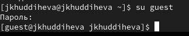
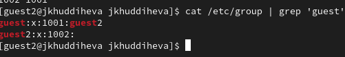
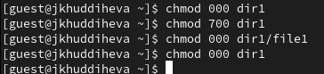

---
## Front matter
lang: ru-RU
title: Презентация по лабораторной работе 2
subtitle: Основы информационной безопасности
author:
  - Худдыева
institute:
  - Российский университет дружбы народов, Москва, Россия
date: 13 сентября 2025

## i18n babel
babel-lang: russian
babel-otherlangs: english

## Formatting pdf
toc: false
toc-title: Содержание
slide_level: 2
aspectratio: 169
section-titles: true
theme: metropolis
header-includes:
 - \metroset{progressbar=frametitle,sectionpage=progressbar,numbering=fraction}
 - '\makeatletter'
 - '\beamer@ignorenonframefalse'
 - '\makeatother'
---

## Цель работы

Получение практических навыков работы в консоли с атрибутами файлов, закрепление теоретических основ дискреционного разграничения доступа в современных системах с открытым кодом на базе ОС Linux1.

## Выполнение лабораторной работы

В операционной систем, которую я установила во время предыдущей лабораторной работы, я создаю учетную запись пользователя guest, используя учетную запись администратора(рис.1).

{#fig:001 width=70%}

## Выполнение лабораторной работы

Я задаю пароль для нового пользователя guest(рис.2)

{#fig:001 width=70%}

## Выполнение лабораторной работы

Затем я вхожу в систему как гость(рис.3)

{#fig:001 width=70%}
Я использую команду pwd, чтобы определить каталог, в котором я нахожусь. После сравнения с запросом командной строки, я вижу что уже нахожусь в домашнем каталог

## Выполнение лабораторной работы

Я указываю имя пользователя, группу и группы, к которым принадлежит пользователь, с помощью команды id. Команда group выдает мне только имя пользователя, но с помощью команды id я получаю больше информации (информация, указанная выше)(рис.4)

{#fig:001 width=70%}

## Выполнение лабораторной работы

Имя пользователя, которое я получаю после запуска команды whoami, совпадает с именем пользователя в приглашении командной строкой

## Выполнение лабораторной работы

Я просматриваю файл /etc/passwd с помощью Cat /etc/passwd | Grep guest команда. Вывод, который я получаю, - это коды имени пользователя и группы, а также адрес для моего домашнего каталога(рис.5)

{#fig:001 width=70%}

## Выполнение лабораторной работы

Я определяю существующие каталоги в системе с помощью команды ls -l /home/. Мне удалось получить список поддиректории имени пользователя и группы каталогов каталога /home, а также права доступа(рис.6)

{#fig:001 width=70%}

## Выполнение лабораторной работы

Я попытался проверить, какие расширенные атрибуты установлены в подкаталогах, расположенных в каталоге /home, с помощью команды: lsattr/home, но не удалось увидеть расширенные атрибуты каталога

## Выполнение лабораторной работы

Я создаю подкаталог dir1 в своем домашнем каталоге с помощью команды mkdir dir1. Я проверяю, какие права доступа и расширенные атрибуты были установлены для каталога dir1 с помощью команд ls -l и lsattr. Как и ожидалось, с lsattr это не сработало(рис.7)

{#fig:001 width=70%}

## Выполнение лабораторной работы

Я удаляю все атрибуты из каталога dir1 с помощью команды chmod 000 dir1 и с помощью ls -l проверьте правильность выполнения команды(рис.8)

{#fig:001 width=70%}

## Выполнение лабораторной работы

Пример заполнения таблицы 2.1(рис.9)

{#fig:001 width=70%}

## Выполнение лабораторной работы

| | | | | |
|-|-|-|-|-|
|Операция|Минимальные права на директорию|Минимальные права на файл
|Создание файла|d(300)|-|
|Удаление файла|d(300)|-|
|Чтение файла|d(100)|(400)|
|Запись в файл|d(100)|(200)|
|Переименование файла|d(300)|(000)|
|Создание поддиректории|d(300)|-|
|Удаление поддиректории|d(300)|-|

Таблица 2.2 “Минимальные права для совершения операций"

## Выводы

Выполнив эту работу я получила практические навыки работы в консоли с атрибутами файлов, закрепление теоретических основ дискреционного разграничения доступа в современных системах с открытым кодом на базе ОС Linux1.

  

