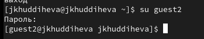
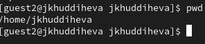
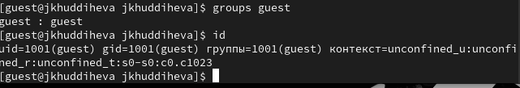
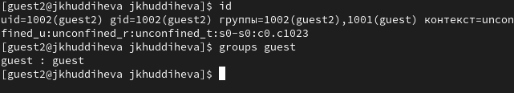
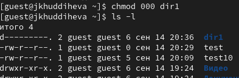
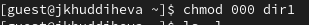

---
## Front matter
title: "Отчёта по лабораторной работе 2"
subtitle: "Основы информационной безопасности"
author: "Худдыева Дженнет, НКА-01-23"

## Generic otions
lang: ru-RU
toc-title: "Содержание"

## Bibliography
bibliography: bib/cite.bib
csl: pandoc/csl/gost-r-7-0-5-2008-numeric.csl

## Pdf output format
toc: true # Table of contents
toc-depth: 2
lof: true # List of figures
lot: true # List of tables
fontsize: 12pt
linestretch: 1.5
papersize: a4
documentclass: scrreprt
## I18n polyglossia
polyglossia-lang:
  name: russian
  options:
	- spelling=modern
	- babelshorthands=true
polyglossia-otherlangs:
  name: english
## I18n babel
babel-lang: russian
babel-otherlangs: english
## Fonts
mainfont: PT Serif
romanfont: PT Serif
sansfont: PT Sans
monofont: PT Mono
mainfontoptions: Ligatures=TeX
romanfontoptions: Ligatures=TeX
sansfontoptions: Ligatures=TeX,Scale=MatchLowercase
monofontoptions: Scale=MatchLowercase,Scale=0.9
## Biblatex
biblatex: true
biblio-style: "gost-numeric"
biblatexoptions:
  - parentracker=true
  - backend=biber
  - hyperref=auto
  - language=auto
  - autolang=other*
  - citestyle=gost-numeric
## Pandoc-crossref LaTeX customization
figureTitle: "Рис."
tableTitle: "Таблица"
listingTitle: "Листинг"
lofTitle: "Список иллюстраций"
lotTitle: "Список таблиц"
lolTitle: "Листинги"
## Misc options
indent: true
header-includes:
  - \usepackage{indentfirst}
  - \usepackage{float} # keep figures where there are in the text
  - \floatplacement{figure}{H} # keep figures where there are in the text
---

# Цель работы

Получение практических навыков работы в консоли с атрибутами файлов, закрепление теоретических основ дискреционного разграничения доступа в современных системах с открытым кодом на базе ОС Linux1.

# Задание

1. Работа с атрибутами файлов

2. Заполнение таблицы “Установленные права и разрешённые действия” (см.табл. 2.1)

3. Заполнение таблицы “Минимальные права для совершения операций” (см.табл. 2.2)

# Выполнение лабораторной работы

**Работа с атрибутами файлов**

В операционной систем, которую я установила во время предыдущей лабораторной работы, я создаю учетную запись пользователя guest, используя учетную запись администратора(рис.1).

{#fig:001 width=70%}

Я задаю пароль для нового пользователя guest(рис.2)

{#fig:001 width=70%}

Затем я вхожу в систему как гость(рис.3)

{#fig:001 width=70%}

Я использую команду pwd, чтобы определить каталог, в котором я нахожусь. После сравнения с запросом командной строки, я вижу что уже нахожусь в домашнем каталог.

Я указываю имя пользователя с помощью команды whoami.
Я указываю имя пользователя, группу и группы, к которым принадлежит пользователь, с помощью команды id. Команда group выдает мне только имя пользователя, но с помощью команды id я получаю больше информации (информация, указанная выше)(рис.4)

{#fig:001 width=70%}

(рис.5)

{#fig:001 width=70%}

Я просматриваю файл /etc/passwd с помощью Cat /etc/passwd | Grep guest команда. Вывод, который я получаю, - это коды имени пользователя и группы, а также адрес для моего домашнего каталога(рис.7)

{#fig:001 width=70%}

Я определяю существующие каталоги в системе с помощью команды ls -l /home/. Мне удалось получить список поддиректории имени пользователя и группы каталогов каталога /home, а также права доступа(рис.8)

{#fig:001 width=70%}

Я попытался проверить, какие расширенные атрибуты установлены в подкаталогах, расположенных в каталоге /home, с помощью команды: lsattr/home, но не удалось увидеть расширенные атрибуты каталога

Я создаю подкаталог dir1 в своем домашнем каталоге с помощью команды mkdir dir1.Я удаляю все атрибуты из каталога dir1 с помощью команды chmod 000 dir1 и с помощью ls -l проверьте правильность выполнения команды(рис.9)

{#fig:001 width=70%}

Попытка создать файл в директории dir1. Выдает ошибку: “Permission denied”

Вернув права директории и использовав снова командy ls -l можно убедиться, что файл не был создан.

**Заполнение таблицы 2.1**

| | | | | | | | | | |
|-|-|-|-|-|-|-|-|-|-|
|Права директории|Права файла|Создание файла|Удаление файла|Запись файла|Чтение файла|Смена директории|Просмотр файлов в директории|Перемеименование файла|Смена атрибутов файла|
|d(000)|(000)|-|-|-|-|-|-|-|-|
|d(000)|(100)|-|-|-|-|-|-|-|-|
|d(000)|(200)|-|-|-|-|-|-|-|-|
|d(000)|(300)|-|-|-|-|-|-|-|-|
|d(000)|(400)|-|-|-|-|-|-|-|-|
|d(000)|(500)|-|-|-|-|-|-|-|-|
|d(000)|(600)|-|-|-|-|-|-|-|-|
|d(000)|(700)|-|-|-|-|-|-|-|-|
|d(100)|(000)|-|-|-|-|+|-|-|+|
|d(100)|(100)|-|-|-|-|+|-|-|+|
|d(100)|(200)|-|-|+|-|+|-|-|+|
|d(100)|(300)|-|-|+|-|+|-|-|+|
|d(100)|(400)|-|-|-|+|+|-|-|+|
|d(100)|(500)|-|-|-|+|+|-|-|+|
|d(100)|(600)|-|-|+|+|+|-|-|+|
|d(100)|(700)|-|-|+|+|+|-|-|+|
|d(200)|(000)|-|-|-|-|-|-|-|-|
|d(200)|(100)|-|-|-|-|-|-|-|-|
|d(200)|(200)|-|-|-|-|-|-|-|-|
|d(200)|(300)|-|-|-|-|-|-|-|-|
|d(200)|(400)|-|-|-|-|-|-|-|-|
|d(200)|(500)|-|-|-|-|-|-|-|-|
|d(200)|(600)|-|-|-|-|-|-|-|-|
|d(200)|(700)|-|-|-|-|-|-|-|-|
|d(300)|(000)|+|+|-|-|+|-|+|+|
|d(300)|(100)|+|+|-|-|+|-|+|+|
|d(300)|(200)|+|+|+|-|+|-|+|+|
|d(300)|(300)|+|+|+|-|+|-|+|+|
|d(300)|(400)|+|+|-|+|+|-|+|+|
|d(300)|(500)|+|+|-|+|+|-|+|+|
|d(300)|(600)|+|+|+|+|+|-|+|+|
|d(300)|(700)|+|+|+|+|+|-|+|+|
|d(400)|(000)|-|-|-|-|-|+|-|-|
|d(400)|(100)|-|-|-|-|-|+|-|-|
|d(400)|(200)|-|-|-|-|-|+|-|-|
|d(400)|(300)|-|-|-|-|-|+|-|-|
|d(400)|(400)|-|-|-|-|-|+|-|-|
|d(400)|(500)|-|-|-|-|-|+|-|-|
|d(400)|(600)|-|-|-|-|-|+|-|-|
|d(400)|(700)|-|-|-|-|-|+|-|-|
|d(500)|(000)|-|-|-|-|+|+|-|+|
|d(500)|(100)|-|-|-|-|+|+|-|+|
|d(500)|(200)|-|-|+|-|+|+|-|+|
|d(500)|(300)|-|-|+|-|+|+|-|+|
|d(500)|(400)|-|-|-|+|+|+|-|+|
|d(500)|(500)|-|-|-|+|+|+|-|+|
|d(500)|(600)|-|-|+|+|+|+|-|+|
|d(500)|(700)|-|-|+|+|+|+|-|+|
|d(600)|(000)|-|-|-|-|-|+|-|-|
|d(600)|(100)|-|-|-|-|-|+|-|-|
|d(600)|(200)|-|-|-|-|-|+|-|-|
|d(600)|(300)|-|-|-|-|-|+|-|-|
|d(600)|(400)|-|-|-|-|-|+|-|-|
|d(600)|(500)|-|-|-|-|-|+|-|-|
|d(600)|(600)|-|-|-|-|-|+|-|-|
|d(600)|(700)|-|-|-|-|-|+|-|-|
|d(700)|(000)|+|+|-|-|+|+|+|+|
|d(700)|(100)|+|+|-|-|+|+|+|+|
|d(700)|(200)|+|+|+|-|+|+|+|+|
|d(700)|(300)|+|+|+|-|+|+|+|+|
|d(700)|(400)|+|+|-|+|+|+|+|+|
|d(700)|(500)|+|+|-|+|+|+|+|+|
|d(700)|(600)|+|+|+|+|+|+|+|+|
|d(700)|(700)|+|+|+|+|+|+|+|+|

Таблица 2.1 «Установленные права и разрешённые действия»

Пример заполнения таблицы 2.1(рис.10)

{#fig:001 width=70%}

**Заполнение таблицы 2.2**

| | | | | |
|-|-|-|-|-|
|Операция|Минимальные права на директорию|Минимальные права на файл
|Создание файла|d(300)|-|
|Удаление файла|d(300)|-|
|Чтение файла|d(100)|(400)|
|Запись в файл|d(100)|(200)|
|Переименование файла|d(300)|(000)|
|Создание поддиректории|d(300)|-|
|Удаление поддиректории|d(300)|-|

Таблица 2.2 “Минимальные права для совершения операций"

# Выводы

Выполнив эту работу я получила практические навыки работы в консоли с атрибутами файлов, закрепление теоретических основ дискреционного разграничения доступа в современных системах с открытым кодом на базе ОС Linux1.

# Список литературы{.unnumbered}

002-lab_discret_attr.pdf: Кулябов Д. С., Королькова А. В., Геворкян М. Н.

