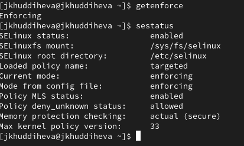

---
## Front matter
lang: ru-RU
title: Презентация по лабораторной работе 5
subtitle: Основы информационной безопасности
author:
  - Худдыева
institute:
  - Российский университет дружбы народов, Москва, Россия
date: 14 сентября 2025

## i18n babel
babel-lang: russian
babel-otherlangs: english

## Formatting pdf
toc: false
toc-title: Содержание
slide_level: 2
aspectratio: 169
section-titles: true
theme: metropolis
header-includes:
 - \metroset{progressbar=frametitle,sectionpage=progressbar,numbering=fraction}
 - '\makeatletter'
 - '\beamer@ignorenonframefalse'
 - '\makeatother'
---

## Цель работы

Изучение механизмов изменения идентификаторов, применения SetUID- и Sticky-битов. Получение практических навыков работы в консоли с дополнительными атрибутами. Рассмотрение работы механизма смены идентификатора процессов пользователей, а также влияние бита Sticky на запись и удаление файлов.

## Задание

1. Создание программы

2. Исследование Sticky-бита

## Выполнение лабораторной работы

Для этой лабораторной работы, вам необходимо проверить установлен ли компилятор(gcc), используя команду gcc -v. Также осуществляется отключение системы запретом с помощью setenforce 0(рис.1)

{#fig:001 width=70%}

## Выполнение лабораторной работы

{#fig:001 width=70%}

## Выполнение лабораторной работы

Я создала файл simpled.c и записала в него код(рис.3)

{#fig:001 width=70%}

## Выполнение лабораторной работы

Я компилировала файл и запустила программы(рис.3)

{#fig:001 width=70%}

## Выполнение лабораторной работы

Я использовала chown, чтобы сменить владельца файла на суперпользователя, и chmod, чтобы изменить права доступа(рис.4)

{#fig:001 width=70%}

## Выполнение лабораторной работы

Я создала, записывала в файл в readfile.с(рис.5)

{#fig:001 width=70%}

## Выполнение лабораторной работы

При попытке прочитать содержимое файла shadow с помощью программы readfile выдается тоже сообщение “размытая информация”(рис.18)

{#fig:001 width=70%}

## Выполнение лабораторной работы

При попытке прочитать содержимое файла shadow с помощью программы readfile от имени пользователя guest получилось(рис.6)

{#fig:001 width=70%}

## Выполнение лабораторной работы

Я проверила папку tmp на наличие атрибута Sticky, потому что в выходных данных есть буква t, значит, атрибут установлен(рис.8)

{#fig:001 width=70%}

## Выполнение лабораторной работы

От имени пользователя Nelianjovu создала файл с текстом, добавляла права на чтение и запись для других пользователей(рис.21)

{#fig:001 width=70%}

## Выполнение лабораторной работы

Вхожу в систему от имени пользователя guest2, от его имени перезаписать информацию в файле file 01.txt не могу(рис.9)

{#fig:001 width=70%}

## Выполнение лабораторной работы

От имени суперпользователя снимала с директории атрибут Sticky(рис.23)

{#fig:001 width=70%}

## Выполнение лабораторной работы

Я проверила, что атрибут действительно снят(рис.24)

{#fig:001 width=70%}

## Выполнение лабораторной работы

Далее я повторила предыдущие действия. Согласно результатам, запись в файл и повторная запись в файл оставались невозможными без Sticky-бита(рис.25)

## Выводы

Выполнив эту работу, я изучила механизмы изменения идентификаторов, применения SetUID- и Sticky-битов и получила практические навыки работы в консоли с дополнительными атрибутами. Рассмотрила работы механизма смены идентификатора процессов пользователей, а также влияние бита Sticky на запись и удаление файлов.
