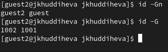
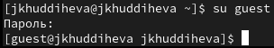
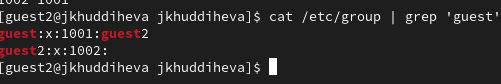
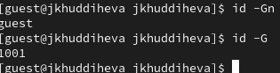

---
## Front matter
lang: ru-RU
title: Презентация по лабораторной работе 3
subtitle: Основы информационной безопасности
author:
  - Худдыева
institute:
  - Российский университет дружбы народов, Москва, Россия
date: 14 сентября 2025

## i18n babel
babel-lang: russian
babel-otherlangs: english

## Formatting pdf
toc: false
toc-title: Содержание
slide_level: 2
aspectratio: 169
section-titles: true
theme: metropolis
header-includes:
 - \metroset{progressbar=frametitle,sectionpage=progressbar,numbering=fraction}
 - '\makeatletter'
 - '\beamer@ignorenonframefalse'
 - '\makeatother'
---

## Цель работы

Получение практических навыков работы в консоли с атрибутами файлов для групп пользователей1

## Задание

1. Создание пользователя guest2, добавление его в группу пользователей guest.

2. Заполнение таблицы 3.1

3. Заполнение таблицы 3.2 на основе таблицы 3.1

## Выполнение лабораторной работы

В предыдущей лабораторной работе, в установленной операционной системе, я создала учётную запись guest. А также установила пароль для пользователя guest. Я делаю то же самое, чтобы создать guest2(рис.1 и рис.2).

{#fig:001 width=70%}

## Выполнение лабораторной работы

{#fig:001 width=70%}

## Выполнение лабораторной работы

Я добавляю пользователя guest2 в группу guest, используя команду group gpasswd -a guest2 guest

## Выполнение лабораторной работы

Я вхожу в систему от двух пользователей на двух разных консолях, guest на первой консоли и guest2 на второй консоли. Используя команду su username

## Выполнение лабораторной работы

Я проверяю имя пользователей с поомощью команды whoami, с помощью команды id могу увидеть группы, к которым принадлежит пользователь и коды этих групп (gid), команда groups просто выведет список групп, в которые входит пользователь. id -Gn - выведет названия групп, которым принадлежит пользовател. id -G - выведет только код групп, которым принадлежит пользователь(рис.3) {#fig:001 width=70%}

## Выполнение лабораторной работы

Затем я отображаю содержимое файла etc/group, в котором показано, что в группе guest есть два пользователя, а в группе guest2 — один(рис.4)

{#fig:001 width=70%}

## Выполнение лабораторной работы

Я регистрирую guest2 в группе guest с помощью команды newgrp (рис.10)

{#fig:001 width=70%}

## Выполнение лабораторной работы

В пользователе guest я удаляю все атрибуты из каталога dir1, созданного в предыдущей лабораторной работе. Проверяю, что права действительно были удалены

