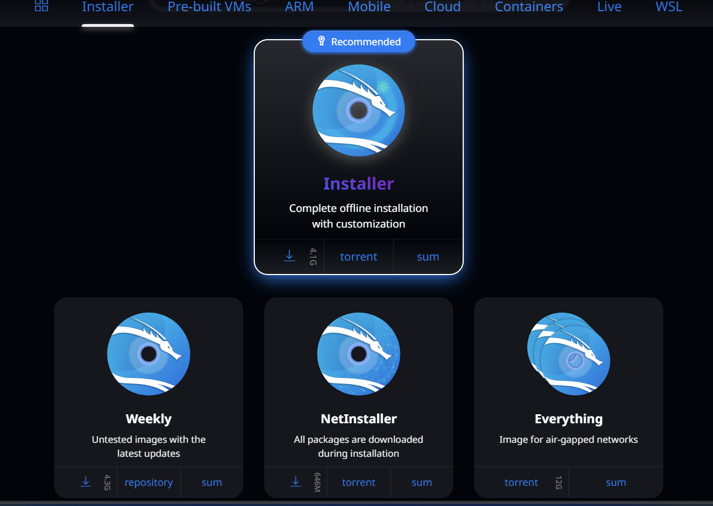
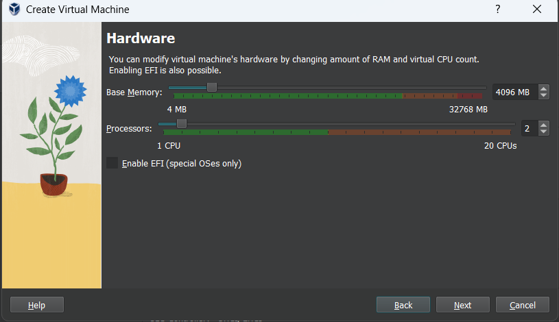

---
## Front matter
lang: ru-RU
title: Презентация по индивидуальнной проекте
subtitle: Основы информационной безопасности
author:
  - Худдыева 
institute:
  - Российский университет дружбы народов, Москва, Россия
date: 15 сентября 2025

## i18n babel
babel-lang: russian
babel-otherlangs: english

## Formatting pdf
toc: false
toc-title: Содержание
slide_level: 2
aspectratio: 169
section-titles: true
theme: metropolis
header-includes:
 - \metroset{progressbar=frametitle,sectionpage=progressbar,numbering=fraction}
 - '\makeatletter'
 - '\beamer@ignorenonframefalse'
 - '\makeatother'
---

## Цель работы

Приобретение практических навыков по установке операционной системы Linux на витуальную машину.

## Задание

1. Установить Kali Linux на витуальную машину.

## Выполнение лабораторной работы

Я создала новую виртуальную машину, указивая имя и образ ISO(рис.1)

{#fig:001 width=70%}

## Выполнение лабораторной работы

Я указывала размер основной памяти виртуальной машины и выбрала количество процессора(рис.2)

{#fig:001 width=70%}

## Выполнение лабораторной работы

Я установила размер диска на 40ГБ(рис.3)

{#fig:001 width=70%}

## Выполнение лабораторной работы

Я согласилася с полученными характеристиками(рис.4)

{#fig:001 width=70%}

## Выполнение лабораторной работы

Установщик проверяла диски и предлагала различные варианты, в зависимости от настроек. Созданный виртуальный диск чистый, поэтому я выбирала весь диск(entire disk)(рис.16)

{#fig:001 width=70%}

## Выполнение лабораторной работы

Затем я выбирала нужный виртуальный диск

## Выполнение лабораторной работы

Далее установщик предлагала выбрать схему разметки, ее я оставляла по умолчанию все файлы в одном разделе(all files in one partition)(

## Выполнение лабораторной работы

После этого я подтвердила окончание разбиения диска, чтобы изменения были записаны(рис.19)

{#fig:001 width=70%}

## Выполнение лабораторной работы

Затем установщик позволяет вам еще раз просмотреть конфигурацию диска, прежде чем вносить постоянные изменения. После этого этапа начнется установка(рис.20)

{#fig:001 width=70%}

## Выполнение лабораторной работы

Дальше я выбрала какой метапакеты (пустые пакеты, описывающие только зависимости), которые я хотела установить

## Выполнение лабораторной работы

Я подтвердила установку системы загрузчика системы GRUB из проекта GNU (программа для управления процессом загрузки),я также выбирала виртуальный диск, на который будет установлен GRUB(рис.23)

{#fig:001 width=70%}

## Выполнение лабораторной работы

Я завершала установку(рис.24)

{#fig:001 width=70%}

## Выполнение лабораторной работы

Я проверяла, что в носителях теперь пусто(рис.25)

{#fig:001 width=70%}

## Выполнение лабораторной работы

Я входила в систему от имени своего пользователя(рис.26)

{#fig:001 width=70%}

## Выполнение лабораторной работы

Это выполнен успешно(рис.27)

{#fig:001 width=70%}

# Выводы

Выполнив эту работу, я приобрела практические навыки по установке операционной системы Linux на витуальную машину.
