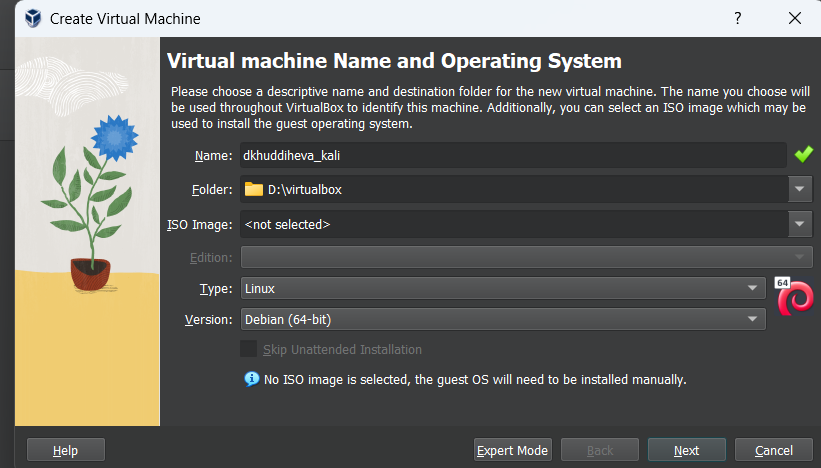
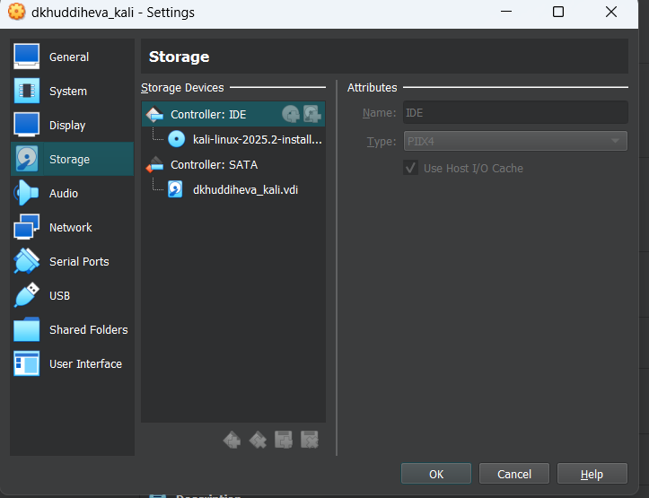

---
## Front matter
title: "Отчёта по индивидуальнной проекте 1"
subtitle: "Основы информационной безопасности"
author: "Худдыева Дженнет"

## Generic otions
lang: ru-RU
toc-title: "Содержание"

## Bibliography
bibliography: bib/cite.bib
csl: pandoc/csl/gost-r-7-0-5-2008-numeric.csl

## Pdf output format
toc: true # Table of contents
toc-depth: 2
lof: true # List of figures
lot: true # List of tables
fontsize: 12pt
linestretch: 1.5
papersize: a4
documentclass: scrreprt
## I18n polyglossia
polyglossia-lang:
  name: russian
  options:
  - spelling=modern
  - babelshorthands=true
polyglossia-otherlangs:
  name: english
## I18n babel
babel-lang: russian
babel-otherlangs: english
## Fonts
mainfont: PT Serif
romanfont: PT Serif
sansfont: PT Sans
monofont: PT Mono
mainfontoptions: Ligatures=TeX
romanfontoptions: Ligatures=TeX
sansfontoptions: Ligatures=TeX,Scale=MatchLowercase
monofontoptions: Scale=MatchLowercase,Scale=0.9
## Biblatex
biblatex: true
biblio-style: "gost-numeric"
biblatexoptions:
  - parentracker=true
  - backend=biber
  - hyperref=auto
  - language=auto
  - autolang=other*
  - citestyle=gost-numeric
## Pandoc-crossref LaTeX customization
figureTitle: "Рис."
tableTitle: "Таблица"
listingTitle: "Листинг"
lofTitle: "Список иллюстраций"
lotTitle: "Список таблиц"
lolTitle: "Листинги"
## Misc options
indent: true
header-includes:
  - \usepackage{indentfirst}
  - \usepackage{float} # keep figures where there are in the text
  - \floatplacement{figure}{H} # keep figures where there are in the text
---

# Цель работы

Приобретение практических навыков по установке операционной системы Linux на витуальную машину.

# Задание

1. Установить Kali Linux на витуальную машину.

# Выполнение лабораторной работы

Я создала новую виртуальную машину, указивая имя и образ ISO(рис.1)

{#fig:001 width=70%}

Я указывала размер основной памяти виртуальной машины и выбрала количество процессора(рис.2)

{#fig:001 width=70%}

Я установила размер диска на 40ГБ(рис.3)

{#fig:001 width=70%}

Я согласилася с полученными характеристиками(рис.4)

{#fig:001 width=70%}

Я проверяла подключен ли образ диска к носителю(рис.5)

По умолчанию, это же имя предлагается как имя моей учетной записи-с маленькими буквами(рис.13)

{#fig:001 width=70%}

Я ввела пароль для созданного пользователя.
Установщик проверяла диски и предлагала различные варианты, в зависимости от настроек. Созданный виртуальный диск чистый, поэтому я выбирала весь диск(entire disk)

После этого я подтвердила окончание разбиения диска, чтобы изменения были записаны.
Затем установщик позволяет вам еще раз просмотреть конфигурацию диска, прежде чем вносить постоянные изменения. После этого этапа начнется установка(рис.20)

{#fig:001 width=70%}

Я входила в систему от имени своего пользователя.
Это выполнен успешно

# Выводы

Выполнив эту работу, я приобрела практические навыки по установке операционной системы Linux на витуальную машину.

