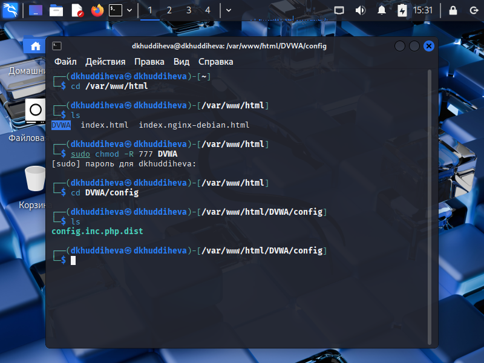
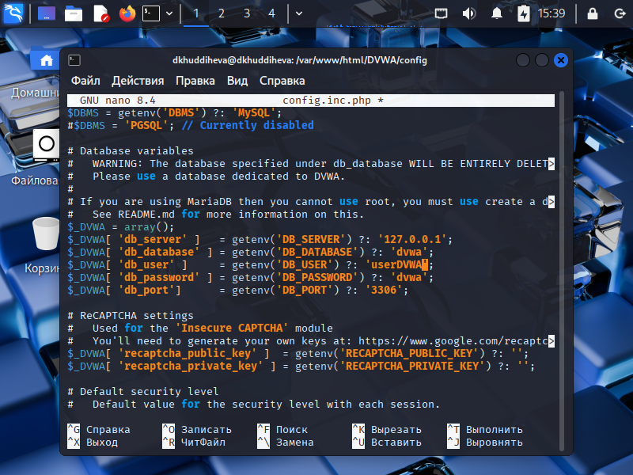
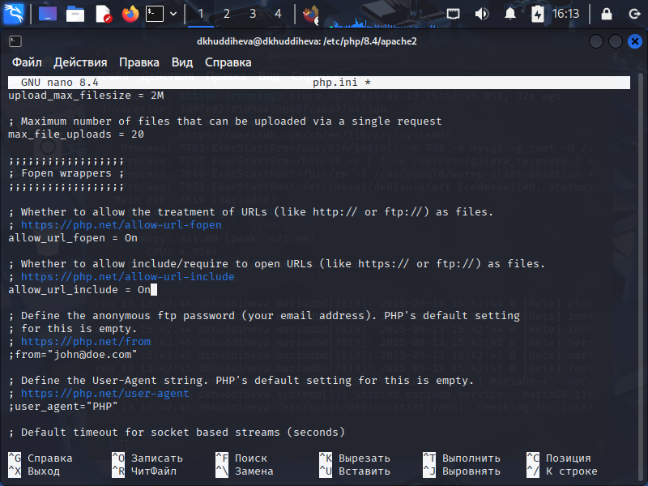
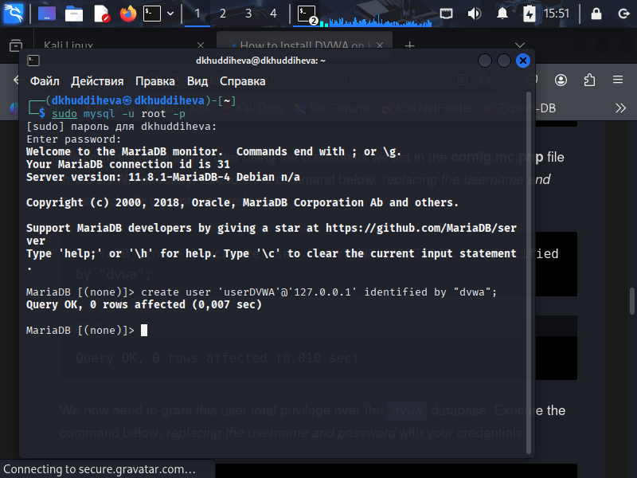
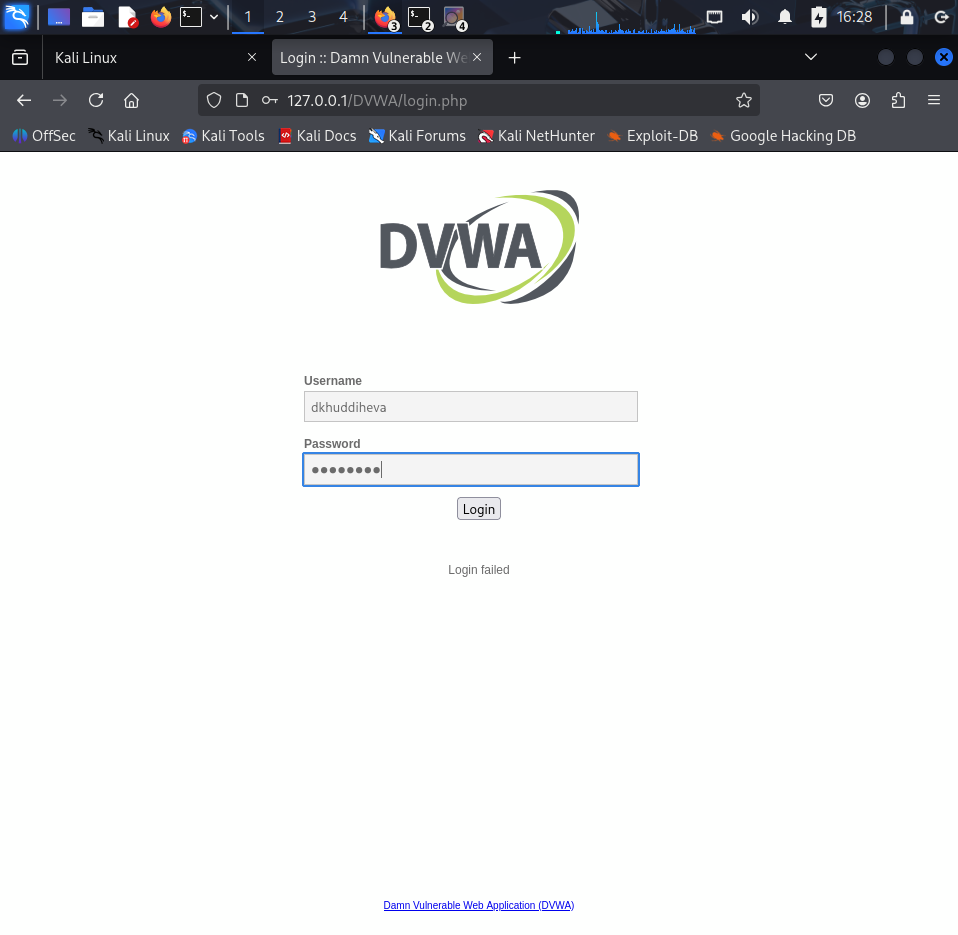

---
## Front matter
lang: ru-RU
title: Презентация по индивидуальнной прокте: Этап 2
subtitle: Основы информационной безопасноти
author:
  - Худдыева
institute:
  - Российский университет дружбы народов, Москва, Россия
date: 18 марта 2025

## i18n babel
babel-lang: russian
babel-otherlangs: english

## Formatting pdf
toc: false
toc-title: Содержание
slide_level: 2
aspectratio: 169
section-titles: true
theme: metropolis
header-includes:
 - \metroset{progressbar=frametitle,sectionpage=progressbar,numbering=fraction}
 - '\makeatletter'
 - '\beamer@ignorenonframefalse'
 - '\makeatother'
---

## Цель работы

Приобретение практических навыков по установке DVWA.

## Задание

1. Установите DVWA на дистрибутив Kali Linux

## Выполнение лабораторной работы

Поскольку я буду настраивать DVWA на моем локальном хостинге, я откываю терминал и перехожу в каталог /var/www/html. Затем я клонирую репозиторий DVWA на github в каталог /html, используя команду git clone(рис.1).

{#fig:001 width=70%}

## Выполнение лабораторной работы

После этого, я запускаю команду ls, чтобы подвердить, что DVWA был успешно клонирован. После подверждения я меняю права доступа к файла DVWA(рис.2)

{#fig:001 width=70%}

## Выполнение лабораторной работы

Чтобы настроить DVWA, нужно перейти в каталог /dvwa/config, затем проверяю содержимое каталога(рис.3)

{#fig:001 width=70%}

## Выполнение лабораторной работы

Я делаю копию файла config.inc.php.dist, называю его config.inc.php. Я использую новый файл для настройки DVWA.Файл config.inc.php.dist не изменяем его, чтобы у нас будет запасной вариант, если что-то пойдет не так(рис.4)

{#fig:001 width=70%}

## Выполнение лабораторной работы

Теперь я открываю файл config.inc.php с помощью редактора nano, чтобы выполнить необходимые настройки.

## Выполнение лабораторной работы

По умолчанию Kali Linux поставляется с установленным Система управления реляционными базами данных MariaDB. Поэтому мне не нужно устанавливать никаких пакетов, я просто запускаю службу mysql командой sudo systemctl start mysql(рис.7)

{#fig:001 width=70%}

## Выполнение лабораторной работы

Я вхожу в базу данных, используя команду sudo mysql -u root -p. В этом случае я использую root, так как это имя суперпользователя, установленное в моей системе. Затем я создаю нового пользователя, используя учетные данные, которые я установил в файле config.inc.php(рис.8)

{#fig:001 width=70%}

## Выполнение лабораторной работы

Необходимо настроить сервер apache2, перехожу в соответствующую директорию(рис.10)

## Выполнение лабораторной работы

Я прокручиваю страницу вниз, ищу строки allow_url_fopen и allow_url_include и убеждаюсь, что обе они включены(рис.12)

{#fig:001 width=70%}

## Выполнение лабораторной работы

Я запускаю службу веб-сервера apache и проверяю, запущена ли служба 

## Выполнение лабораторной работы

Я настроила DVWA, Apache и базу данных, поэтому открываю браузер и запускаю веб-приложение, введя 127.0.0/DVWA(рис.14)
{#fig:001 width=70%}

## Выполнение лабораторной работы

Я авторизуюсь с помощью предложенных по умолчанию данных

## Выполнение лабораторной работы

Я оказываюсь на домшней странице веб-приложения, на этом установка окончена

## Выводы

Выполнив эту работе, я приобрела практических навыков по установке уязвимого веб-приложения DVWA.

